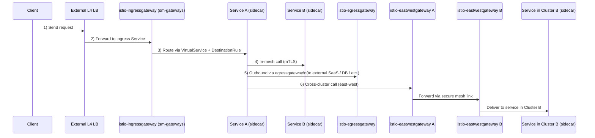

Да, это GitHub-овский Mermaid ругается на `<br/>` в названиях нод. Там сейчас довольно строгий парсер: без HTML и прочей экзотики.

Вот исправленные версии, которые должны нормально рендериться на GitHub.

---

### 1) Flowchart: single-cluster + multi-cluster

```mermaid
flowchart LR
  %% ==== Outside the mesh ====
  client[Client]
  lb[External L4 LB ]

  %% ==== Cluster A ====
  subgraph clusterA[Cluster A]
    direction LR

    igw[Istio IngressGateway (ns: sm-gateways)]
    svcA[Service A pod + Envoy sidecar]
    svcB[Service B pod + Envoy sidecar]
    egw[Istio EgressGateway (ns: sm-gateways)]
    ewA[Istio EastWestGateway A (ns: sm-gateways)]
  end

  %% ==== Cluster B ====
  subgraph clusterB[Cluster B]
    direction LR

    svcB2[Service in Cluster B + Envoy sidecar]
    ewB[Istio EastWestGateway B (ns: sm-gateways)]
  end

  ext[(External destination: SaaS / DB / API)]

  %% ---- Single-cluster north-south + in-mesh ----
  client -->|1| lb
  lb -->|2| igw
  igw -->|3 (VirtualService + DestinationRule)| svcA
  svcA -->|4 mTLS| svcB
  svcA -->|5 (egress policy)| egw
  egw --> ext

  %% ---- Multi-cluster east-west ----
  svcA -->|6| ewA
  ewA --> ewB
  ewB --> svcB2
```

---

### 2) Sequence diagram: строго по шагам 1–6



Если хочешь, можем отдельно сделать ещё упрощённый вариант только для single-cluster, чтобы использовать его в “Intro” секции, а этот оставить как “detailed”.
