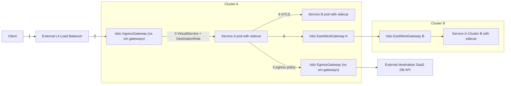
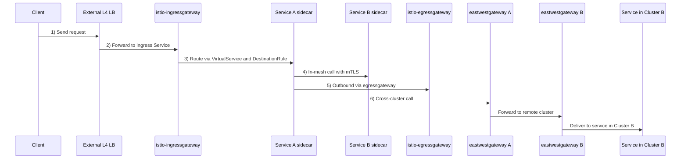

Да, похоже, GitHub-овский Mermaid очень капризный. Давай сделаем максимально простой и совместимый вариант: без скобок, двоеточий и HTML.

### 1) Flowchart: single-cluster + multi-cluster

---

### 2) Sequence diagram по шагам 1–6

Если всё ещё будут ошибки, попробуй сначала только `graph LR` кусок без `subgraph` и комментариев — но этот вариант обычно нормально рендерится на GitHub.
