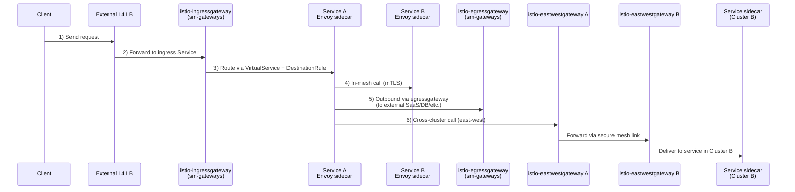

Вот вариант в виде диаграммы-как-код на Mermaid. Её можно сразу рендерить в Markdown (GitHub, GitLab, MkDocs, Obsidian и т.п.).

### 1) Flowchart: архитектура + single-cluster + multi-cluster

```mermaid
flowchart LR
  %% ==== Outside the mesh ====
  client[Client]
  lb[External L4 LB<br/>(bare-metal / cloud)]

  %% ==== Cluster A ====
  subgraph clusterA[Cluster A]
    direction LR

    igw[Istio IngressGateway<br/>(Service, ns: sm-gateways)]
    svcA[Service A Pod<br/>+ Envoy sidecar]
    svcB[Service B Pod<br/>+ Envoy sidecar]
    egw[Istio EgressGateway<br/>(ns: sm-gateways)]
    ewA[Istio EastWest Gateway A<br/>(ns: sm-gateways)]
  end

  %% ==== Cluster B ====
  subgraph clusterB[Cluster B]
    direction LR

    svcB2[Service in Cluster B<br/>+ Envoy sidecar]
    ewB[Istio EastWest Gateway B<br/>(ns: sm-gateways)]
  end

  ext[(External destination<br/>SaaS / DB / API)]

  %% ---- Single-cluster north-south + in-mesh ----
  client -->|1| lb
  lb -->|2| igw
  igw -->|3 (VS + DR)| svcA
  svcA -->|4 mTLS| svcB
  svcA -->|5 (egress policy)| egw
  egw --> ext

  %% ---- Multi-cluster east-west ----
  svcA -->|6| ewA
  ewA --> ewB
  ewB --> svcB2
```

---

### 2) Sequence diagram: ровно по шагам 1–6



Оба варианта можно править как обычный текст: добавлять неймспейсы, порты, дополнительные сервисы и т.д.
